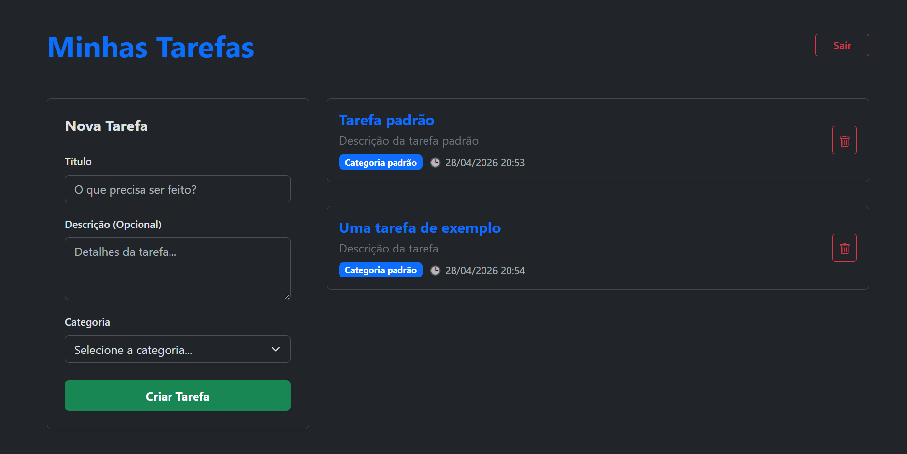

# API egSys

API REST para gerenciamento de tarefas. 

## Requisitos

- Java 21 ou superior;
- Maven 4.1.0 ou superior (caso deseje rodar a aplicação via linha de comando);

> **Nota:** Se você for utilizar uma IDE (como IntelliJ IDEA, Eclipse ou VS Code), não é obrigatório ter o Maven instalado globalmente na sua máquina, pois a IDE já gerencia as dependências utilizando sua versão embutida.

## Como executar

Você tem três formas de executar a aplicação:

### Opção 1: IDE (Recomendado)
1. Importe/abra a pasta do projeto na sua IDE.
2. Aguarde a IDE baixar as dependências automaticamente.
3. Navegue até o arquivo `TarefasApplication.java` (em `src/main/java/com/example/tarefas/TarefasApplication.java`).
4. Execute a classe (Run).

### Opção 2: Linha de Comando (Terminal)
1. Certifique-se de que o Maven está instalado e configurado nas variáveis de ambiente.
2. Abra um terminal na pasta raiz do projeto (onde está localizado o arquivo `pom.xml`).
3. Execute o comando abaixo para iniciar a aplicação:

```bash
mvn spring-boot:run
```

### Opção 3: Docker
Se você não possui Java ou Maven configurados na sua máquina, a forma mais rápida de avaliar o projeto é utilizando o Docker. O Docker Compose irá configurar todo o ambiente de forma transparente.
1. Certifique-se de que o **Docker Desktop** ou **Docker Engine** está rodando no seu computador.
2. Abra o terminal na pasta raiz do projeto (onde está o arquivo `docker-compose.yml`).
3. Execute o comando abaixo:

```bash
docker-compose up --build
```
> **Nota:** Na primeira vez que for executado, o comando pode levar 1 ou 2 minutos, pois o Docker fará o download do Java 21, construirá a aplicação inteira sozinho e iniciará a API na sequência.

Independente da opção escolhida, a aplicação estará disponível em: `http://localhost:8080`.

## Testes Unitários

O projeto possui uma suíte de testes unitários desenvolvida em **JUnit 5** e **Mockito**, validando as principais regras de negócio dos Controladores (`CategoriaController` e `TarefaController`), incluindo tratamento de exceções (como tentar criar tarefas com categorias inexistentes).

Para rodar os testes, utilize o comando:

```bash
mvnw test
```
*(Se estiver no Windows, use `.\mvnw.cmd test`)*

### Interface Interativa

O projeto conta com uma interface gráfica minimalista, funcional e testável embutida no próprio servidor. Desenvolvida para que você possa avaliar as rotas da API na prática. Iniciada a aplicação, ela pode ser testada em [http://localhost:8080/](http://localhost:8080/) no seu navegador!

 

## Autenticação

A API utiliza segurança baseada em **JWT (JSON Web Token)**. Ao iniciar a aplicação, um usuário padrão é criado automaticamente:
- **Login:** `admin`
- **Senha:** `admin`

Para acessar os endpoints protegidos de categorias e tarefas, você deve primeiro fazer login e obter o token JWT:

### 1. Fazer Login (`/auth/login`)
- `POST /auth/login`
- **Corpo da requisição (JSON):**
  ```json
  {
    "login": "admin",
    "senha": "admin"
  }
  ```
- O retorno será o seu token. Exemplo: `{"token": "eyJhbG..."}`

### 2. Usar o Token
Nas requisições para criar, editar, listar ou deletar tarefas/categorias, adicione o cabeçalho HTTP:
- `Authorization: Bearer SEU_TOKEN_AQUI`

---

## Endpoints Principais

A API responde nos seguintes endpoints principais:

### Categorias (`/categorias`)

- `GET /categorias`: Lista todas as categorias.
  - Exemplo de resposta:
    ```json
    [
      {
        "id": 1,
        "descricao": "Trabalho"
      }
    ]
    ```
- `GET /categorias/{id}`: Busca uma categoria pelo ID.
- `POST /categorias`: Cria uma nova categoria.
  - Exemplo de corpo (JSON):
    ```json
    {
      "descricao": "Trabalho"
    }
    ```
- `PUT /categorias/{id}`: Atualiza uma categoria existente.
- `DELETE /categorias/{id}`: Deleta uma categoria pelo ID.

### Tarefas (`/tarefas`)

- `GET /tarefas`: Lista todas as tarefas.
  - Exemplo de resposta:
    ```json
    [
      {
        "id": 1,
        "titulo": "Finalizar relatório",
        "descricao": "Escrever a conclusão e enviar.",
        "categoria": {
          "id": 1,
          "descricao": "Trabalho"
        },
        "dataHora": "2026-05-01T14:30:00"
      }
    ]
    ```
- `GET /tarefas/{id}`: Busca uma tarefa pelo ID.
- `POST /tarefas`: Cria uma nova tarefa. **Atenção:** A categoria é obrigatória.
  - Exemplo de corpo (JSON):
    ```json
    {
      "titulo": "Finalizar relatório",
      "descricao": "Escrever a conclusão e enviar.",
      "categoria": {
        "id": 1
      }
    }
    ```
- `PUT /tarefas/{id}`: Atualiza uma tarefa existente.
- `DELETE /tarefas/{id}`: Deleta uma tarefa pelo ID.

## Banco de Dados H2 (Console)

O console do H2 está habilitado para facilitar a visualização dos dados.
- **URL:** `http://localhost:8080/h2-console`
- **JDBC URL:** `jdbc:h2:mem:tarefasdb`
- **User Name:** `egsys`
- **Password:** `egsys`

## Documentação da API (Swagger)

A documentação interativa da API está configurada através do Swagger/OpenAPI.
- **Acesse em:** `http://localhost:8080/swagger-ui.html`
- **JSON Definition:** `http://localhost:8080/v3/api-docs`

> **Dica de Autenticação no Swagger:**  
> Como a API agora é protegida, você precisará clicar no botão verde **"Authorize"** (no canto superior direito do Swagger) e colar o seu token JWT gerado pela rota `/auth/login`. Após fazer isso, o Swagger passará a enviar o seu token em todas as requisições!
